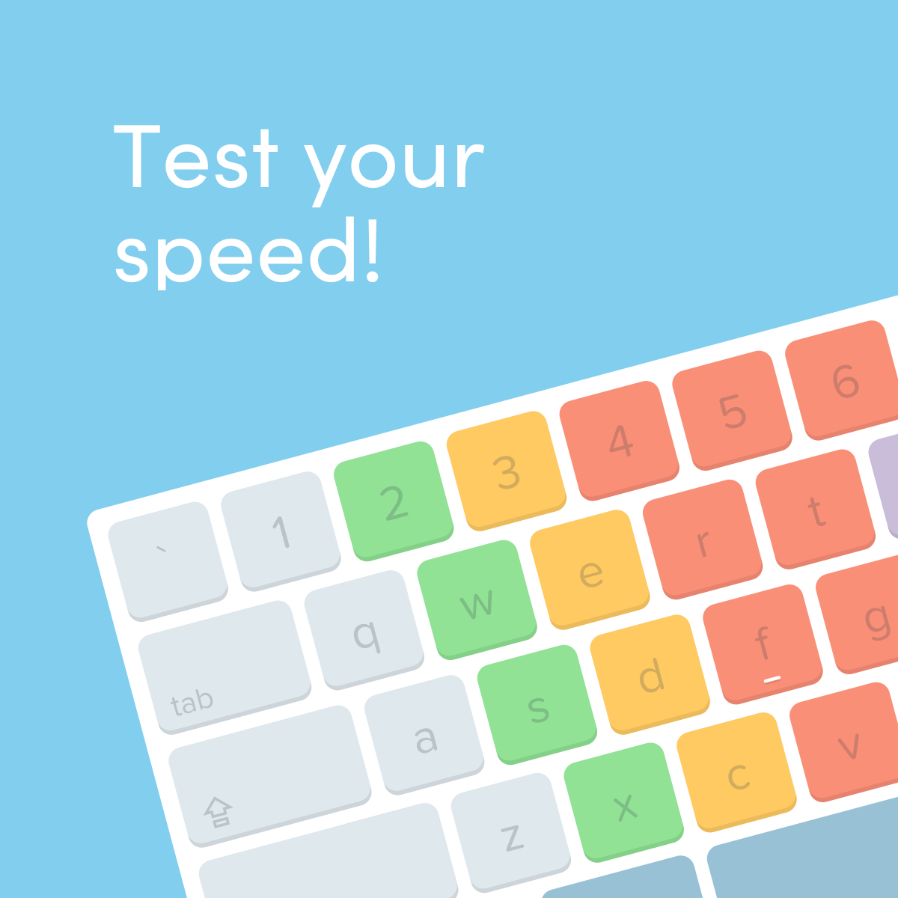
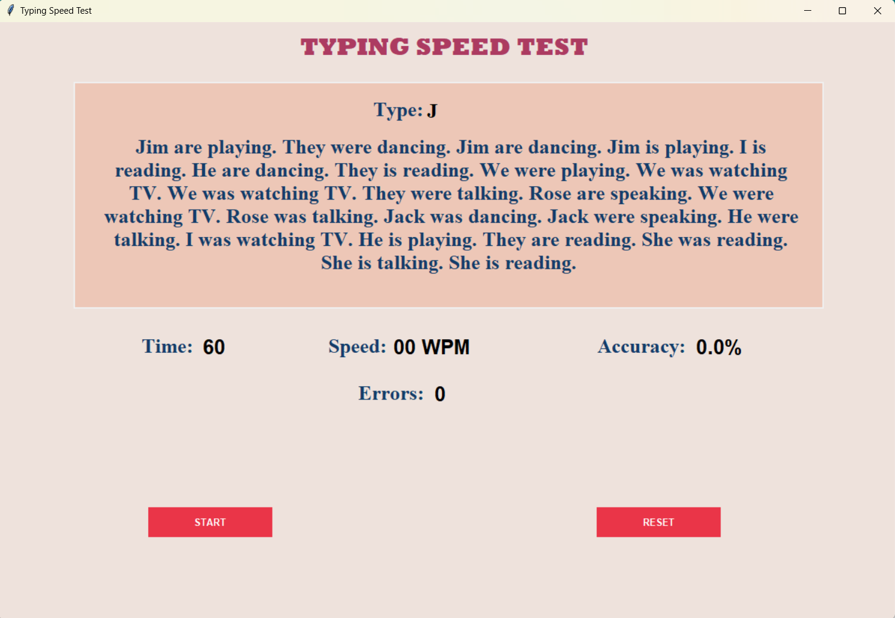

# Typing Speed Test



This project is a **Typing Speed Test** application built using Python and the Tkinter library. It generates random sentences for users to type and measures typing speed, accuracy, and error count over a 60-second period.

## Features

- **Random Text Generation**: The app generates random sentences from a pool of names, verbs, and nouns to give users a unique typing challenge each time.
- **Real-time Typing Metrics**: While the user types, the application calculates:
  - Typing speed in **Words Per Minute (WPM)**
  - **Accuracy** based on correctly typed characters
  - Number of **Errors** made during typing
- **Countdown Timer**: The app gives users 60 seconds to type as much as they can. The timer is displayed and turns red when the time drops below 10 seconds.
- **Dynamic Text Updates**: As the user types, the text dynamically updates, removing typed characters and displaying the next one to be typed.
- **Completion Message**: When the user completes the text or the time runs out, a congratulatory or time-up message is displayed.

## Screenshots

### Main Screen
 <br>
The start screen includes a button that initiates the typing test. The background and design provide a clean and easy-to-navigate user experience.

### Typing Interface
Once the test starts, users see the typing area, real-time statistics, and a reset button to restart the test.

- **Timer**: Displays the remaining time in seconds.
- **Text to Type**: A random text is generated, which users need to type as fast and as accurately as possible.
- **Errors**: Displays the total number of errors made.
- **Accuracy**: Shows the typing accuracy as a percentage.
- **WPM**: Displays the typing speed in words per minute.

### Reset and Start Button
The application includes buttons to start and reset the test.

## How to Use

1. **Start the Test**: Click the "Start" button on the main screen.
2. **Type the Given Text**: Type the randomly generated text as fast and accurately as possible.
3. **View Results**: Monitor your typing speed, accuracy, and error count in real time.
4. **Reset**: Click the "Reset" button to start a new test with a fresh set of sentences.

## Installation

1. Clone the repository:
   ```bash
   git clone https://github.com/your-repo/typing-speed-test.git
   ```
2. Install the required libraries:
    ```bash
    pip install tkinter
    ```
3. Run the application:
   ```bash
   python typing_speed_test.py
   ```

## Requirements
- Python 3.x
- Tkinter Library (included with most Python installations)

## Future Enhancements
- Improve sentence complexity by adding more words and structures.
- Add a leaderboard feature to track users’ high scores.
- Provide more visual feedback during the test, such as highlighting errors in real-time.

## License
This project is licensed under the MIT License.
